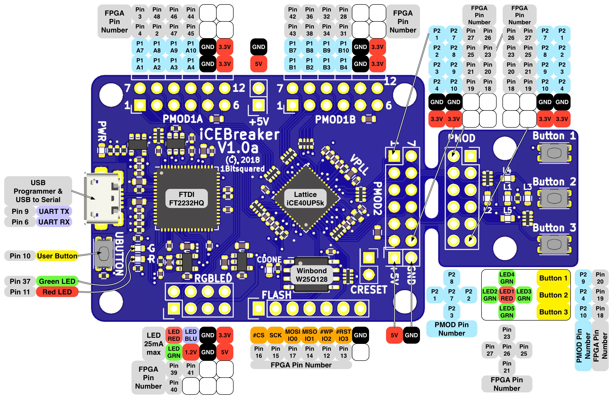

# Bilbao Maker Faire October 2018 FPGA beginner's workshop 
Shortlink to this documentation: [http://bit.ly/bbmf-fpga](http://bit.ly/bbmf-fpga). Viewing the documentation online allows you to click links more easily!

Using the [IceBreaker board](https://github.com/icebreaker-fpga/icebreaker)
Soon to be available on [CrowdSupply](https://www.crowdsupply.com/1bitsquared/icebreaker-fpga)

## Setup

* Install [Icestudio](https://github.com/FPGAwars/icestudio#installation)
* Install the [workshop package](https://github.com/mattvenn/collection-bilbao-makerfaire-2018/archive/master.zip)

## Switching between collections in Icestudio

[Installing and changing collections in Icestudio](https://github.com/Obijuan/digital-electronics-with-open-FPGAs-tutorial/wiki/Video-5:-Colecciones-en-Icestudio#instalaci%C3%B3n)

## Challenges

### LEDS on

connect the boards LEDs to the 1 and 0 bits.

Solution: -> LEDS -> simple

Use more blocks to turn on other LEDs on the board.

### Buttons

Instead of using a 1 or 0 bit block, use a button to turn on and off an LED

In the default collection, add a logic -> gate -> not to invert the button.

### LEDs blinking

Add a clock input by adding a basic -> input block and setting it's name and input to CLK.
Attach the clk to an LED. Is the LED blinking?

To slow the clock down, add a logic -> sequential -> Prescalar22 from the default collection.
The Prescalar22 block needs to go between the clk input and the LED output.

### Button combo

Use a combination of buttons to light LED

In the default collection, use Logic -> Gate -> And to build a circuit that turns
on an LED when button 1 AND button2 are pressed.

Solution: Examples -> Buttons -> button logic

Try other logic combinations, for example:

* LED on when button1 AND button2 AND button3
* LED on when (button1 AND button2) OR button3 

### All LEDs blinking at different rates

Using the Bilbao collection, load Examples -> LED -> different rates.

* Try changing the number in the compare box to change the rate of the LED.
* How does this differ from changing the PrescalarN width parameter?

Add more Counter -> 8bit compare blocks to make all the LEDs flash at different rates.
Try setting them to 50, 49, 48, 47 and 46.

### LEDs counting

Load the Examples -> LED -> counter.

This counts from 0 to 15 on the LEDs.

Decimal	| Binary
------- | ------
0	| 0000
1	| 0001

Try removing the clock and using a button to increase the counter.

Advanced: Make the counter count backwards.

* Create a new Basic -> Code
* input ports: clk
* output ports: count[3:0]
* copy the verilog from the 4bit counter block into your new block
* make a change to the verilog to count down instead of up
* drag and drop the new module over the old to replace it while keeping the connections

### red VGA

Load Examples -> VGA -> red

Upload onto the board and check the display shows a red screen.

The AND gates are used so that the red, green and blue outputs are only on when the active video signal is true.

Modify the 1s and 0s to change the colour on the screen.

### colour control

Instead of using the 1s and 0s to change the colours, use the 3 buttons.

Solution: Examples -> VGA -> buttons

### split colours

Make the bottom half of the screen blue.

In the Bilbao collection, use the Counter -> 10bit compare block to compare the y_px output of the VGA block with a parameter.

Use the *more* output of the compare block to drive the AND gate of the blue signal.

Solution: Examples -> VGA -> half blue

#### Advanced

* use the equal output of the 10bit compare block to show lines
* use the x_px output of the VGA to do vertical splits
* use 2 10bit compare blocks to draw a cross on the screen
	* Solution: Examples -> VGA -> cross
* use other logic gates to change the colours depending on the split

### adjustable wipe

Load Examples -> VGA -> adjustable wipe 

Use buttons 1 and 3 to move the horizontal split up and down.

Try:

* change the colours on each side
* change it to a vertical wipe
* copy the counter and comparision blocks to make an adjustable vertical AND horizontal wipe.

# Resources

* [Obijuan's digital electronics tutorial - in Spanish](https://github.com/Obijuan/digital-electronics-with-open-FPGAs-tutorial/wiki)
* [Obijuan's verilog tutorial - in Spanish](https://github.com/Obijuan/open-fpga-verilog-tutorial/wiki)
